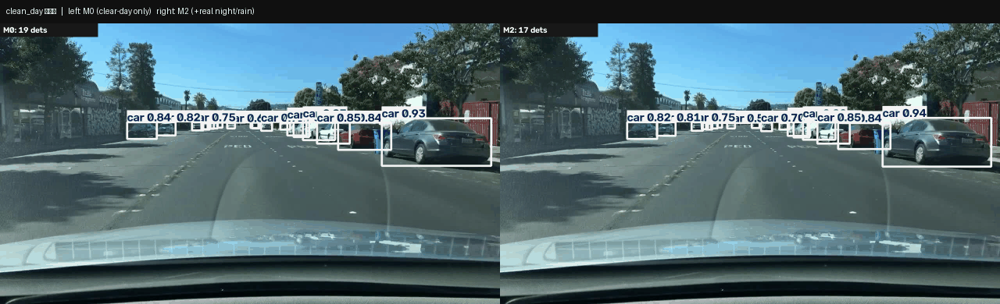

# RobustVision-by-have-supper

本项目训练了一个**恶劣条件下更可靠的驾驶目标检测器**：以三模型阶梯量化并恢复夜间/雨天/图像损坏条件下的检测性能，发布旗舰模型权重与 model card；验证模型所用的整套评测协议同步开源为检测器无关的评测引擎 **rvkit**。

> 数据集：BDD100K（10 万张真实驾驶图像，10 类）｜模型：YOLO11m（COCO 迁移微调）｜全部训练在本机单张 RTX 4060 Laptop（8GB）完成，零云算力

## 主结果：三模型阶梯

三个模型**除训练数据外配置完全一致**（同起点 / 同轮数协议 / batch 8 / seed 42），每一级增量都可归因：

| 模型 | 训练数据 | 定位 |
| --- | --- | --- |
| M0 | 仅「晴天∩白天」11,454 张 | 基线：量出分布偏移的伤害 |
| M1 | + 3,436 张合成损坏副本 | 合成增强的价值 |
| **M2** ⭐ | + 4,009 张合成副本 + **4,000 张真实夜间/雨天** | 旗舰：发布权重 |

**成绩（mAP50-95，test 侧 13 条件）**：

| 维度 | M0 | M1 | M2 |
| --- | ---: | ---: | ---: |
| 晴天白天（clean） | 0.3022 | **0.3024** | 0.2961 |
| **夜间** | 0.2231 | 0.2206 | **0.2546** |
| 雨（自然） | 0.2750 | 0.2809 | **0.2943** |
| 自然偏移平均（夜/雨/雪/晨昏） | 0.2668 | 0.2678 | **0.2822** |
| 合成损坏平均（7 种） | 0.2538 | **0.2723** | 0.2673 |

**三个发现**（完整分析见 [docs/case_study.md](docs/case_study.md)）：

1. **合成增强是"对称解药"但不迁移**：M1 对训练时见过的同类损坏大幅恢复（高斯噪声 −34.3%→−15.1%），对真实夜间零迁移（−26.2%→−27.0%）；
2. **真实与合成互补、各治一类偏移**：M2 用 4,000 张真夜景把夜间从 0.2206 拉到 0.2546（**+3.40 分，夜间退化砍半至 −14.0%**），代价是 clean −0.61 分与合成损坏 −0.50 分——全部明码标价；
3. **置信度校准的分条件差异**：全局温度缩放让各条件 ECE 下降 9~30%，但 M2 在夜间反而微升——见过真实夜景后其夜间置信度本就诚实（"对条件越熟悉，置信度越可信"）。

## 演示（同一帧，M0 vs M2）



左 M0（只见晴天白天）｜右 M2（+ 真实夜雨数据）。更多失败案例见 `results/qualitative*/`。

## 权重下载

M0 / M1 / M2 的 best.pt 将随 **Release v0.1.0** 发布（含 model card）：

- `m0_best.pt` / `m1_best.pt` / `m2_best.pt` ——（发布后在此填入链接）

## 评测引擎 rvkit（快速上手）

对**任意** Ultralytics `.pt` 权重一条命令生成条件 × 损坏的退化矩阵报告（表 + 热力图 + 按类分解）：

```bash
pip install -e .                                   # 或 git+https://github.com/CCYEX/RobustVision-by-have-supper.git
rvkit checkup --model best.pt \
  --splits data/splits/cloud_eval/ \               # 条件名单目录（本 repo 自带）
  --mode labels10 --out results/my_report.md
```

置信度校准（温度缩放 + 分条件 ECE + 可靠性图）：

```bash
python -m rvkit.harness.predict_cache best.pt data/splits/val_all.txt cache/mine.parquet
python -m rvkit.calibration.calibrate cache/mine.parquet
```

## 复现本项目

```bash
# 1) 数据层：官方标注 → YOLO 标签 + 分层切分 + 审计（BDD100K 自行注册下载，放入 data/）
python data/convert.py && python data/make_splits.py && python data/audit.py
# 2) 合成损坏（7 种 × 与干净参照同图配对）
python -m rvkit.harness.generate_corrupt --n 0
# 3) 三模型训练（同一配方，唯一变量=训练数据；约 5/6/6.5 小时 @ 4060）
python experiments/train_m0_live.py                                   # M0
python experiments/train_m1_live.py                                   # M1（先跑 make_aug_copies 组盘）
python experiments/train_m2_live.py                                   # M2
# 4) 全量评测 + 答案缓存 + 校准 + 阶梯表
rvkit checkup --model runs/m2/weights/best.pt --splits data/splits/cloud_eval/ --mode labels10 --out results/m2_full.md
python -m rvkit.harness.predict_cache runs/m2/weights/best.pt data/splits/val_all.txt cache/m2.parquet
python -m rvkit.calibration.calibrate cache/m2.parquet
python experiments/make_ladder.py
```

数据口径与审计发现（天气×时段交叉表、小目标分布、训练池实测）见 [docs/data_card.md](docs/data_card.md)。

## Non-Goals

不做图像复原前端（去雾/增强预处理，有效性缺乏证据）、不做测试时在线适应、不做 TensorRT 导出链、不训练新架构。取舍依据见 case_study。

## License

MIT（代码）；模型权重基于 BDD100K 训练，遵循其研究用途许可，不再分发原图。
