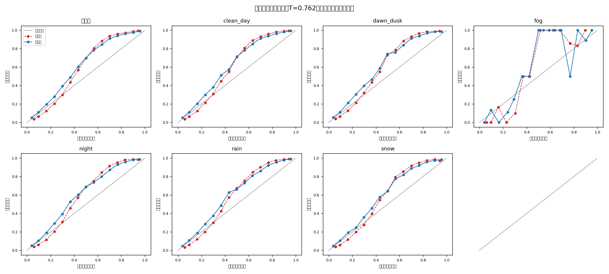

# 置信度校准报告（温度缩放）

模型：m0｜温度 **T = 0.7624**（>1 = 校准前太自信）｜校准集 NLL 0.3754 → 0.3650｜日期：2026-08-30

保险丝检查：校准为单调变换，抽样验证排序逐位不变 → mAP 不变。

| 条件 | 检测数 | ECE 前 | ECE 后 | 相对下降 | MCE 前→后 | Brier 前→后 |
| --- | ---: | ---: | ---: | ---: | --- | --- |
| 未命名 | 84192 | 0.0831 | 0.0698 | 16.1% | 0.251→0.218 | 0.1164→0.1130 |
| clean_day | 48984 | 0.0839 | 0.0710 | 15.4% | 0.255→0.219 | 0.1154→0.1120 |
| dawn_dusk | 16699 | 0.0778 | 0.0682 | 12.4% | 0.251→0.246 | 0.1151→0.1124 |
| fog | 101 | 0.1323 | 0.1063 | 19.7% | 0.484→0.500 | 0.0957→0.0884 |
| night | 103313 | 0.0656 | 0.0525 | 20.0% | 0.214→0.187 | 0.1155→0.1139 |
| rain | 23092 | 0.0678 | 0.0511 | 24.7% | 0.212→0.196 | 0.1098→0.1073 |
| snow | 23984 | 0.0721 | 0.0516 | 28.5% | 0.228→0.210 | 0.1131→0.1100 |

读法：曲线越贴对角线越诚实；夜/雾等恶劣条件校准前普遍压在对角线上方（说 0.8 的把握实际对不到 0.8），校准后应贴回对角线。