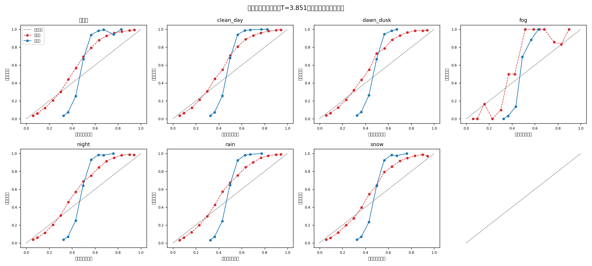

# 置信度校准报告（温度缩放）

模型：m0｜温度 **T = 3.8506**（>1 = 校准前太自信）｜校准集 NLL nan → nan｜日期：2026-08-30

保险丝检查：校准为单调变换，抽样验证排序逐位不变 → mAP 不变。

| 条件 | 检测数 | ECE 前 | ECE 后 | 相对下降 | MCE 前→后 | Brier 前→后 |
| --- | ---: | ---: | ---: | ---: | --- | --- |
| 未命名 | 209524 | 0.0783 | 0.2630 | -236.0% | 0.245→0.374 | 0.1152→0.1803 |
| clean_day | 48984 | 0.0839 | 0.2667 | -218.0% | 0.255→0.377 | 0.1154→0.1812 |
| dawn_dusk | 16699 | 0.0778 | 0.2616 | -236.3% | 0.251→0.381 | 0.1151→0.1801 |
| fog | 101 | 0.1323 | 0.3095 | -134.0% | 0.484→0.369 | 0.0957→0.1769 |
| night | 103313 | 0.0656 | 0.2533 | -286.4% | 0.214→0.364 | 0.1155→0.1789 |
| rain | 23092 | 0.0678 | 0.2624 | -287.0% | 0.212→0.358 | 0.1098→0.1765 |
| snow | 23984 | 0.0721 | 0.2609 | -262.0% | 0.228→0.362 | 0.1131→0.1793 |

读法：曲线越贴对角线越诚实；夜/雾等恶劣条件校准前普遍压在对角线上方（说 0.8 的把握实际对不到 0.8），校准后应贴回对角线。