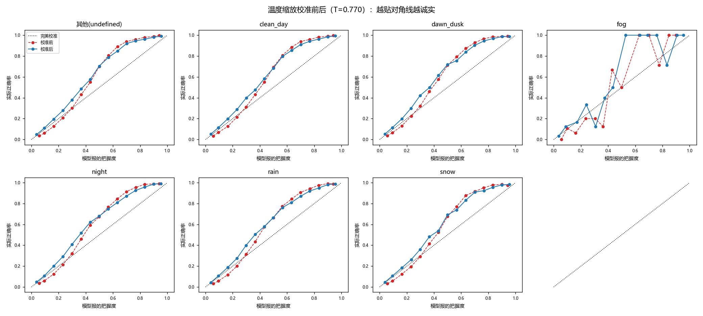

# 置信度校准报告（温度缩放）

模型：m1｜温度 **T = 0.7701**（>1 = 校准前太自信）｜校准集 NLL 0.3769 → 0.3673｜日期：2026-08-31

保险丝检查：校准为单调变换，抽样验证排序逐位不变 → mAP 不变。

| 条件 | 检测数 | ECE 前 | ECE 后 | 相对下降 | MCE 前→后 | Brier 前→后 |
| --- | ---: | ---: | ---: | ---: | --- | --- |
| 其他(undefined) | 83941 | 0.0840 | 0.0690 | 17.8% | 0.257→0.220 | 0.1156→0.1121 |
| clean_day | 48045 | 0.0833 | 0.0720 | 13.6% | 0.252→0.230 | 0.1162→0.1128 |
| dawn_dusk | 16606 | 0.0781 | 0.0697 | 10.7% | 0.239→0.219 | 0.1156→0.1131 |
| fog | 119 | 0.1062 | 0.0739 | 30.4% | 0.371→0.470 | 0.1074→0.1027 |
| night | 104376 | 0.0647 | 0.0533 | 17.6% | 0.214→0.188 | 0.1145→0.1131 |
| rain | 23576 | 0.0698 | 0.0496 | 28.9% | 0.210→0.195 | 0.1086→0.1062 |
| snow | 24337 | 0.0712 | 0.0520 | 27.0% | 0.244→0.208 | 0.1122→0.1093 |

读法：曲线越贴对角线越诚实；夜/雾等恶劣条件校准前普遍压在对角线上方（说 0.8 的把握实际对不到 0.8），校准后应贴回对角线。