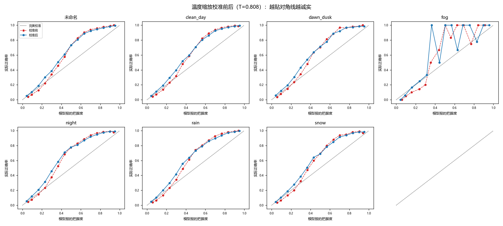

# 置信度校准报告（温度缩放）

模型：m2｜温度 **T = 0.8076**（>1 = 校准前太自信）｜校准集 NLL 0.3976 → 0.3912

保险丝检查：校准为单调变换，抽样验证排序逐位不变 → mAP 不变。

| 条件 | 检测数 | ECE 前 | ECE 后 | 相对下降 | MCE 前→后 | Brier 前→后 |
| --- | ---: | ---: | ---: | ---: | --- | --- |
| 其他(undefined) | 81547 | 0.0876 | 0.0768 | 12.3% | 0.268→0.253 | 0.1194→0.1168 |
| clean_day | 47614 | 0.0842 | 0.0775 | 8.0% | 0.256→0.237 | 0.1195→0.1169 |
| dawn_dusk | 15819 | 0.0824 | 0.0817 | 0.9% | 0.266→0.254 | 0.1221→0.1203 |
| fog | 92 | 0.1202 | 0.0961 | 20.0% | 0.496→0.636 | 0.1062→0.1018 |
| night | 87766 | 0.0831 | 0.0869 | -4.6% | 0.277→0.280 | 0.1306→0.1303 |
| rain | 21151 | 0.0784 | 0.0694 | 11.4% | 0.242→0.233 | 0.1180→0.1163 |
| snow | 22265 | 0.0812 | 0.0658 | 19.0% | 0.245→0.216 | 0.1191→0.1168 |

读法：曲线越贴对角线越诚实；夜/雾等恶劣条件校准前普遍压在对角线上方（说 0.8 的把握实际对不到 0.8），校准后应贴回对角线。