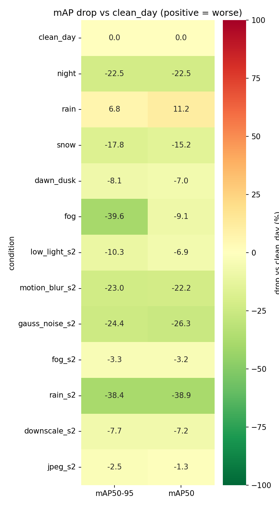

# 迷你体检报告（yolo11s.pt × labels8 口径，2026-08-29）

## 主表

| condition | map | map50 | p | r | rel_drop |
| --- | --- | --- | --- | --- | --- |
| clean_day | 0.2277 | 0.3892 | 0.4789 | 0.3871 | 0.0 |
| night | 0.1764 | 0.3016 | 0.4067 | 0.3283 | -22.5 |
| rain | 0.2432 | 0.4327 | 0.5803 | 0.4023 | 6.8 |
| snow | 0.1871 | 0.33 | 0.504 | 0.3233 | -17.8 |
| dawn_dusk | 0.2093 | 0.362 | 0.511 | 0.3397 | -8.1 |
| fog | 0.1375 | 0.3538 | 0.6517 | 0.2365 | -39.6 |
| low_light_s2 | 0.2043 | 0.3622 | 0.5693 | 0.3296 | -10.3 |
| motion_blur_s2 | 0.1753 | 0.3027 | 0.4935 | 0.2789 | -23.0 |
| gauss_noise_s2 | 0.1722 | 0.287 | 0.5623 | 0.2548 | -24.4 |
| fog_s2 | 0.2202 | 0.3769 | 0.6072 | 0.3278 | -3.3 |
| rain_s2 | 0.1402 | 0.2378 | 0.4528 | 0.2329 | -38.4 |
| downscale_s2 | 0.2101 | 0.3611 | 0.5201 | 0.3479 | -7.7 |
| jpeg_s2 | 0.2219 | 0.384 | 0.5582 | 0.3431 | -2.5 |

## 三行总结

- 最狠的条件：fog（mAP50-95 掉 39.6%，0.2277 → 0.1375）（仅 9 张，仅供参考）
- 掉最狠的类：traffic light（各条件相对白天晴平均掉 31.6%）
- 一句人话：yolo11s.pt 在白天晴天能考 mAP 0.228，到 fog 只剩 0.138；最受伤的是 traffic light 类——恶劣条件主要伤它。

